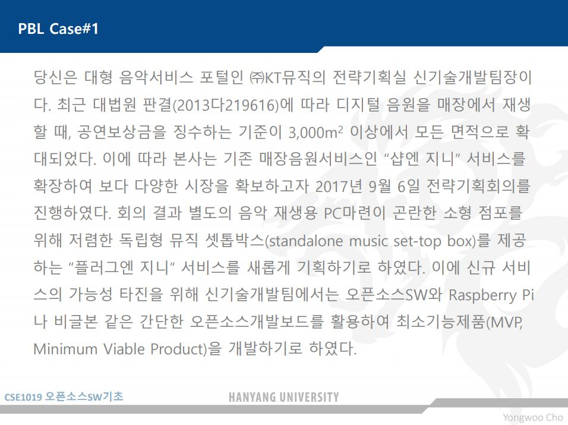
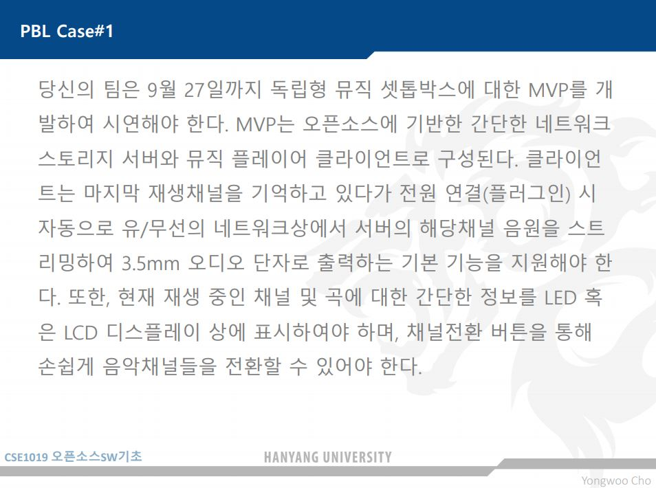
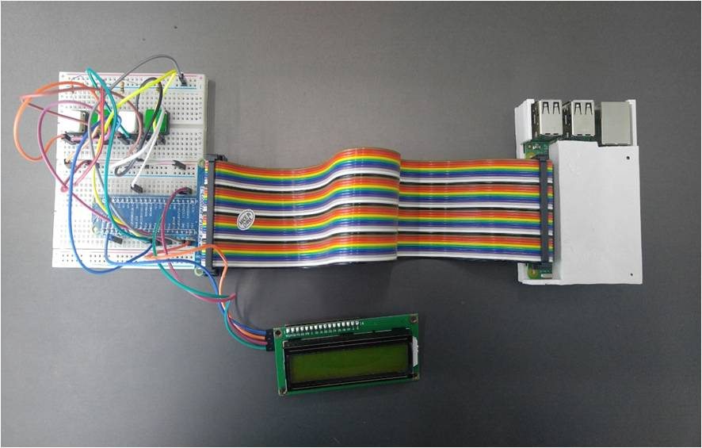
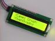
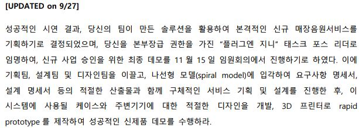
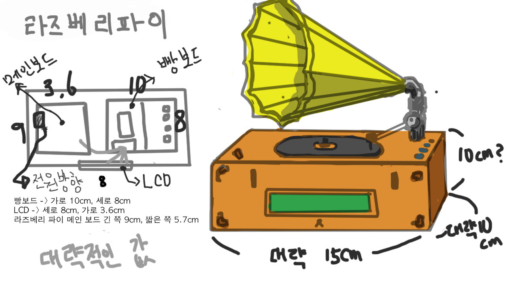
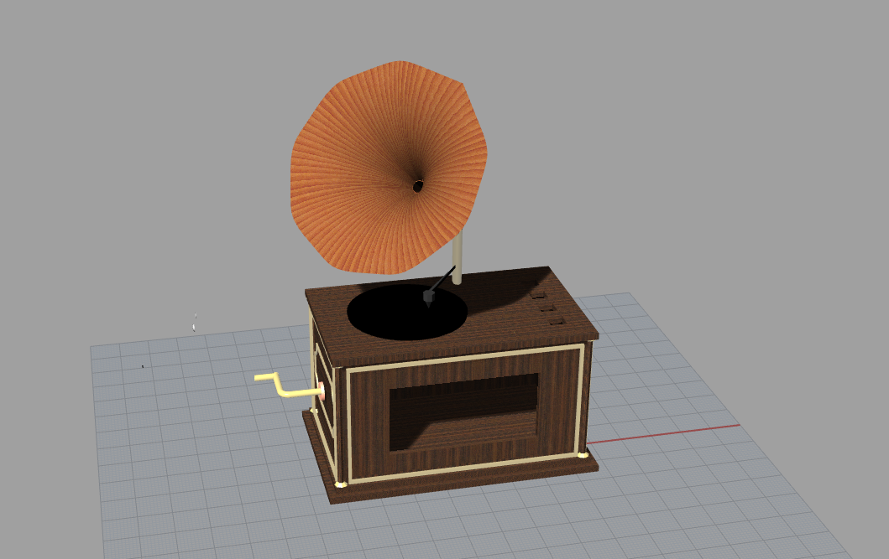
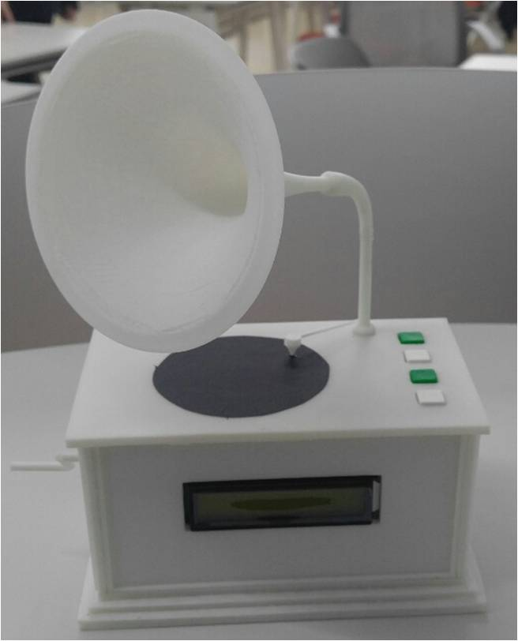

This is the Project of Team 4. (Park simon, Park yubin, Park jumi, Ryu seungjae)

The goal of this project is making the music settop box for small markets who want to play the music in their market.

To clear this problem, Problem solution finding has been started.

The main Topic of this problem is these.

## User need

1. This Product should be targeted to small markets who can't prepare theit own PC because of cost problem.
2. Nice design matched with markets background.
3. Also it is really important to select songs matched with markets atmosphere.
(But number 3 is slightly different from this Project problem.) / (It is related with Big data and music tech)

## Development need

1. Our team should make the MVP(Minimum Viable Product) in very short time. (with raspberry pi)
2. Many functions should be contained in this MVP.
- MVP can load the music from server.
- MVP can remember the last song that MVP played before.
- support 3.5 audio port
- support LED screen let users know the present music information.
- support buttons that have functions such as "Stop / Play", "Go to the next song or channel"

## Development.

Our team Planned to develop this MVP and started to make this MVP.

this is the first Prototype of our Project.

BreadBoard(on the left side of the picture) , Raspberry pi(on the right side of the picture), and LED(middle side) are connected with wire.

## Functions.

The Product has four buttons.

1. Next channel (Green) 
2. Next song (white)
3. Before Channel (Green)
4. Beforne song (white)

The Product's LED Prints artist name and Song name

And last, MVP has a function that runs automatically as soon as power is turned on.
Because MVP should be able to manipulate without PC.

If you wonder the MVP's function and image, Please look at this.

<iframe width="560" height="315" src="https://youtu.be/fyZ9sQ6Hyf0" frameborder="0" gesture="media" allow="encrypted-media" allowfullscreen></iframe>

## New Problem

After Making this MVP, out Team has another issues.

The Design of the product, Service of the product and other elaborate problems etc.

Those Problems should be cleared.

## Design Part

Our Design is motivated by the LP Player. Square wooden box and trumpet. Fisrt design is started that Idea.

To make design real, We use 3D Printer to print product design.

First, We calculate the size of breadboard and raspberry pi and LED to make accurately.

This is the picture of first calculating.

To use 3D print we use Rhino Program. We also learn basic information about 3D Printer.

Detailed explanation is omitted.

# Final Design

This is the final design of the Product (music settop box)

and Finally, This is the Final Product of our team.

While designing, We change the way slightly because of size problem and weight problem.
We use PCB to solve button location problem and weight problem.

This is the Video of the product

<iframe width="560" height="315" src="https://www.youtube.com/embed/kKxWjJZ46Ho" frameborder="0" gesture="media" allow="encrypted-media" allowfullscreen></iframe>

## Final 

## After Creating this product

This Product has slight problem.

Because of the time issue, we can't colored the product. I think it'll more beautiful if we colored this product.

